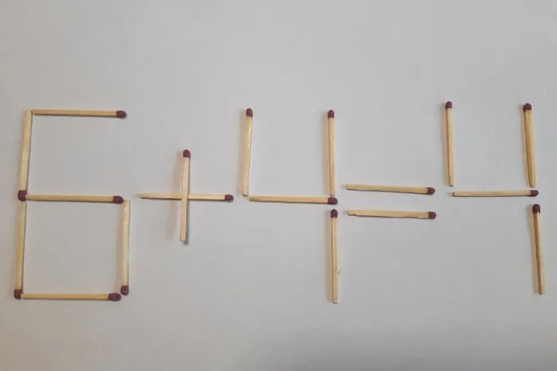

# Matchstick-problem

### Problem: rearrange one matchstick so that the expression becomes correct.

Task: at the input you are given an expression in the format:
a+b=c OR a-b=c, where 0 <= a, b, c <= 9.
For example: 4+3=5, 0-8=7, 0-0=8.
It is necessary to output all the correct expressions
that can be obtained by permuting the matchstick.
